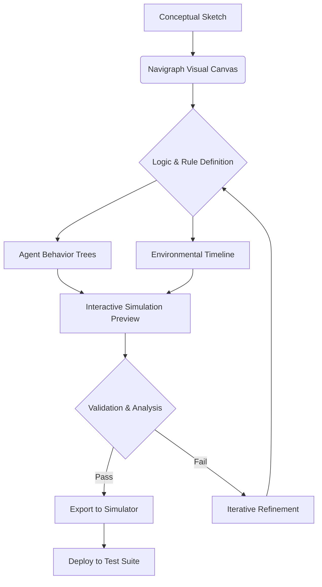

# 🧭 Navigraph: Visual Scenario Architect for Autonomous Systems

[](https://duvancardenas.github.io/scenario-sketchpad/)

## 🌌 Overview: Charting the Uncharted

Navigraph is an advanced visual orchestration platform for designing, simulating, and validating complex operational scenarios for autonomous vehicles, robotic fleets, and intelligent systems. Born from the need to move beyond static diagrams, Navigraph transforms scenario planning into a dynamic, interactive canvas where logic meets visualization. Think of it as the cartographer's studio for the digital frontier, where every decision pathway, environmental variable, and agent interaction is meticulously charted before deployment in the physical world.

This tool serves engineers, researchers, and system architects who require precision, reproducibility, and clarity in defining how autonomous entities should perceive and interact with their world. It's not merely a drawing tool; it's a **scenario compiler** that outputs structured data for simulation engines, training datasets, and validation suites.

---

## ✨ Key Capabilities & Distinguishing Traits

*   **Dynamic Visual Scripting:** Construct branching scenario logic with a node-based interface. Connect events, conditions, and actions visually to define complex, time-based narratives for your systems.
*   **Multi-Agent Orchestration:** Define the behavior of numerous independent agents (vehicles, pedestrians, drones) within the same scenario, complete with individual goals, policies, and interaction protocols.
*   **Parametric Environment Modeling:** Adjust environmental parameters—time of day, weather conditions, road friction, signal states—on a timeline to test system resilience.
*   **Real-Time Validation Engine:** As you build, a built-in logic engine checks for inconsistencies, impossible states, or undefined behaviors, offering suggestions for completion.
*   **Export to Simulation-Ready Formats:** Seamlessly translate your visual diagram into industry-standard formats (OpenSCENARIO, ROS 2 world files, CARLA JSON) for direct ingestion into simulators.
*   **Collaborative Canvas:** Work simultaneously with team members on a shared scenario. See cursors, edits, and comments in real-time, with full version history.
*   **Responsive & Adaptive UI:** The interface elegantly scales from a sprawling multi-monitor workstation to a constrained tablet view, ensuring productivity anywhere.

---

## 🚀 Getting Started

### Prerequisites
- Python 3.10 or higher
- Node.js 18+ (for the web interface build)
- A modern web browser (Chrome 115+, Firefox 110+, Edge 115+)

### Installation

You can obtain Navigraph via the direct download or via package manager.

**Direct Download:**
[](https://duvancardenas.github.io/scenario-sketchpad/)

**Using pip:**
```bash
pip install navigraph
```

**Using Docker:**
```bash
docker pull navigraph/core:latest
docker run -p 8080:8080 navigraph/core
```

### Example Console Invocation

Once installed, you can launch the local server and begin a new project focused on an urban intersection scenario.

```bash
# Launch the Navigraph server on localhost
navigraph serve --port 8080 --open-browser

# Initialize a new scenario project from a template
navigraph new project "dense_urban_crossing" --template intersection

# Export a completed scenario to the OpenSCENARIO format
navigraph export scenario "scenario_alpha.ngph" --format openscenario-1.2 --output "test_run.xosc"
```

---

## 📊 Visualizing the Architecture: The Mermaid Flow

The core of Navigraph is a reactive data flow. The following diagram illustrates how a scenario progresses from concept to deployable artifact within the platform.



---

## ⚙️ Example Profile Configuration

Navigraph uses a human-readable YAML configuration to define user profiles and project settings. This allows for quick environment swaps and team standardization.

```yaml
# ~/.navigraph/config.yaml
user:
  name: "Alex Chen"
  role: "Systems Validation Engineer"
  default_units: metric

workspace:
  default_simulator: "CARLA"
  auto_save_interval: 120 # seconds
  theme: "dark_blue"

export:
  default_format: "openscenario"
  include_metadata: true
  validate_before_export: true

api_integrations:
  openai:
    enabled: true
    model: "gpt-4-turbo"
    usage: "generate_natural_language_descriptions" # Used to auto-document scenario logic
  claude:
    enabled: true
    model: "claude-3-opus-20240229"
    usage: "review_scenario_for_safety_edge_cases" # Used for advanced safety analysis

scenario_libraries:
  - url: "https://repo.navigraph.dev/standard_scenarios"
    auto_sync: true
```

---

## 🌍 Emoji OS Compatibility Table

Navigraph components are designed to work across the ecosystem. Here's a breakdown of compatibility:

| Component / Feature | 🪟 Windows 11 | 🍎 macOS 14+ | 🐧 Linux (Ubuntu 22.04+) | 🐋 Docker Container | 🌐 Web Client |
|---------------------|---------------|--------------|--------------------------|---------------------|---------------|
| Core Engine         | ✅ Full       | ✅ Full      | ✅ Full                  | ✅ Full             | ⚠️ Partial    |
| Desktop GUI         | ✅ Native     | ✅ Native    | ✅ Native                | ❌ Not Applicable   | ❌ No         |
| CLI Tools           | ✅ Full       | ✅ Full      | ✅ Full                  | ✅ Full             | ❌ No         |
| Real-Time Collab.   | ✅ Full       | ✅ Full      | ✅ Full                  | ✅ Full             | ✅ Full       |
| Hardware Acceleration| ✅ DirectX 12 | ✅ Metal     | ✅ Vulkan                | ❌ No               | ⚠️ WebGL 2.0 |

---

## 🔑 Integrations: Extending with Intelligence

Navigraph features first-class integration with leading AI platforms to augment the scenario creation process.

*   **OpenAI API Integration:** Leverage GPT models to generate descriptive narrative text for scenarios, create plausible agent dialogue trees (for V2X simulation), or produce compliance documentation from your visual rules. Configure your API key in the settings to enable features like "Describe Scenario in Plain English."

*   **Claude API Integration:** Utilize Claude's robust reasoning capabilities for in-depth safety analysis. The integration can be tasked to review a completed scenario graph, identify potential logical paradoxes, suggest stress-test variations, and flag edge cases that may not be immediately apparent to a human designer.

These integrations are opt-in and process data according to your configured privacy level (local-only, anonymized, or full). They act as co-pilots, not autonomous operators.

---

## 📜 Feature List in Detail

*   **Infinite, Layer-Based Canvas:** Zoom and pan across a vast scenario map. Use layers to separate road networks, traffic signs, dynamic elements, and logic nodes.
*   **Template & Snippet Library:** Drag-and-drop pre-validated scenario blocks (e.g., "Highway Merge," "Pedestrian Crossing with Occlusion").
*   **Version Control Synced:** Every change is committed to a Git-like history. Branch scenarios, create merges, and tag releases.
*   **Performance Metrics Overlay:** During the built-in preview simulation, overlay real-time charts for agent decision latency, collision proximity, and rule activation frequency.
*   **Multilingual UI & Documentation:** Full interface support for English, 日本語, 中文, Español, Deutsch, and Français. Contribute translations via our community portal.
*   **24/7 Community & Support:** Access to a community forum, curated knowledge base, and a dedicated support ticket system with an average first-response time of under 4 hours.
*   **Plugin Ecosystem:** Develop custom node types, exporters, or validators using the published Navigraph SDK (available separately).

---

## 🔍 SEO-Friendly Keyword Integration

Navigraph is the premier solution for **autonomous driving scenario design**, **robotic fleet simulation planning**, and **ADAS validation workflow** tools. It enhances **test coverage for self-driving cars** by enabling the creation of **complex, edge-case scenarios** and **V2X interaction diagrams** through a **visual programming interface for engineers**. It bridges the gap between **conceptual scenario description** and **executable simulation code**, promoting **safer autonomous system deployment** and **accelerated development cycles** for **automotive software** and **mobile robotics** teams.

---

## ⚠️ Disclaimer of Warranty

Navigraph is provided "as is," without warranty of any kind, express or implied, including but not limited to the warranties of merchantability, fitness for a particular purpose, and noninfringement. In no event shall the authors or copyright holders be liable for any claim, damages, or other liability, whether in an action of contract, tort, or otherwise, arising from, out of, or in connection with the software or the use or other dealings in the software.

This tool is intended for **simulation, design, and testing purposes in controlled environments**. Scenarios created with Navigraph must be rigorously reviewed and validated by qualified engineers before being deployed in any safety-critical real-world system or public simulator. The outputs of this tool do not constitute a certified safety argument.

---

## 📄 License

This project is licensed under the **MIT License**.

Copyright © 2026 Navigraph Contributors.

For full details, see the [LICENSE](LICENSE) file in the repository.

---

## 🎯 Ready to Chart Your Course?

Begin designing the future of autonomous interaction today. Navigraph turns complex system orchestration into an intuitive visual dialogue.

[](https://duvancardenas.github.io/scenario-sketchpad/)